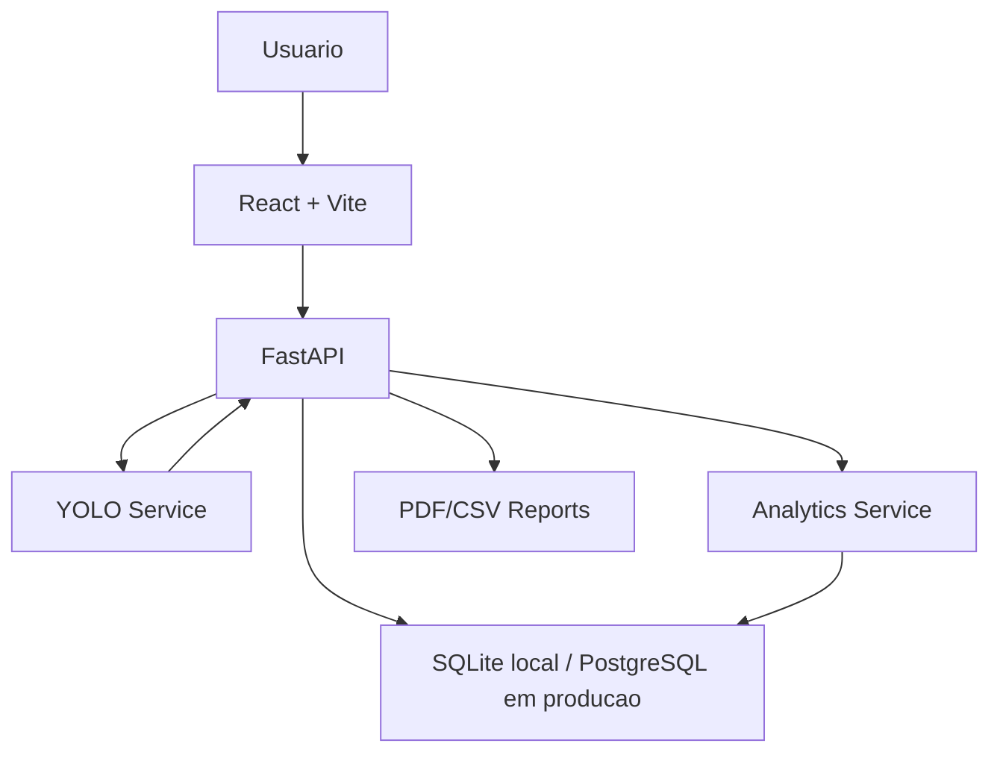

# Smart Parking Analytics

Sistema inteligente de estacionamento com visao computacional, YOLO26, FastAPI e React.

 implementado

- API FastAPI com Swagger.
- Upload de imagem em `POST /api/predict`.
- Upload de video em `POST /api/video/upload`.
- Servico de inferencia YOLO com suporte a `backend/models/best.pt`.
- Modo demo automatico quando o modelo real ainda nao esta disponivel.
- Calculo de ocupacao por vagas cadastradas com poligonos.
- Historico temporal em SQLite local ou PostgreSQL em producao.
- Estatisticas de ocupacao e horarios de pico.
- Alertas quando a ocupacao ultrapassa 90%.
- Relatorios CSV e PDF.
- Dashboard React + Vite com upload, cards, graficos e imagem anotada.
- Modelo YOLO26n treinado com dataset personalizado de classe unica `car`.

## Estrutura

```text
backend/
  app/
    api/
    core/
    db/
    services/
  models/
  uploads/
  outputs/
frontend/
  src/
docs/
dataset/
training/
reports/
```

## Executar o backend

```bash
cd backend
python -m venv .venv
.venv\Scripts\activate
pip install -r requirements.txt
uvicorn app.main:app --reload --port 8000
```

Swagger:

```text
http://localhost:8000/docs
```

## Executar o frontend

```bash
cd frontend
npm install
npm run dev
```

Aplicacao:

```text
http://localhost:5173
```

## Usar modelo treinado

Depois de treinar o YOLO, coloque o arquivo aqui:

```text
backend/models/best.pt
```

Ao reiniciar a API, o servico tentara carregar `best.pt`. Se ele nao existir, tentara carregar `yolo26n.pt`. Se nao conseguir carregar YOLO, entra em modo demo para permitir a demonstracao do fluxo completo.

## Treinamento realizado

Modelo base:

```text
yolo26n.pt
```

Dataset:

```text
Fonte: Roboflow
Formato: YOLO26 Object Detection
Total: 166 imagens
Train: 103 imagens
Validation: 34 imagens
Test: 29 imagens
Classes: car
```

Treinamento:

```text
Epochs: 100
Image size: 640
Batch: 4
Device: CPU
```

Metricas no validation:

```text
Precision: 0.915
Recall: 0.885
mAP50: 0.930
mAP50-95: 0.871
```

Metricas no test:

```text
Precision: 0.913
Recall: 0.919
mAP50: 0.921
mAP50-95: 0.865
```

Artefatos:

```text
docs/training-results/results.csv
docs/training-results/results.png
docs/training-results/confusion_matrix.png
docs/training-results/confusion_matrix_normalized.png
backend/models/best.pt
```

Observacao: o dataset final foi simplificado para classe unica `car`, reduzindo confusao entre classes e melhorando as metricas de deteccao.

## Cadastrar vagas

### Opcao rapida para o novo dataset `car`

Use quando a demo for baseada apenas em deteccao de carros e capacidade total do estacionamento:

```bash
curl -X POST http://localhost:8000/api/parking-spots/capacity ^
  -H "Content-Type: application/json" ^
  -d "{\"parking_lot_id\":\"default\",\"parking_lot_name\":\"Campus Parking\",\"location\":\"Universidade\",\"total_spots\":40}"
```

Nesse modo, o YOLO conta os carros detectados e o sistema calcula:

```text
ocupadas = min(carros_detectados, total_spots)
livres = total_spots - ocupadas
taxa = ocupadas / total_spots
```

### Opcao completa com vagas calibradas

Use quando a imagem/video vier sempre do mesmo enquadramento de camera e voce quiser saber exatamente qual vaga esta livre ou ocupada.

Exemplo:

```bash
curl -X POST http://localhost:8000/api/parking-spots ^
  -H "Content-Type: application/json" ^
  -d "{\"parking_lot_id\":\"default\",\"parking_lot_name\":\"Campus Parking\",\"location\":\"Universidade\",\"spots\":[{\"spot_id\":\"A01\",\"zone\":\"A\",\"polygon\":[[80,260],[220,260],[220,430],[80,430]]},{\"spot_id\":\"A02\",\"zone\":\"A\",\"polygon\":[[240,260],[380,260],[380,430],[240,430]]},{\"spot_id\":\"A03\",\"zone\":\"A\",\"polygon\":[[400,260],[560,260],[560,430],[400,430]]}]}"
```

## Principais endpoints

| Metodo | Rota | Funcao |
|---|---|---|
| `POST` | `/api/predict` | Inferencia em imagem |
| `POST` | `/api/video/upload` | Upload de video |
| `GET` | `/api/occupancy` | Ocupacao atual |
| `GET` | `/api/history` | Historico temporal |
| `GET` | `/api/statistics` | Estatisticas agregadas |
| `GET` | `/api/alerts` | Alertas |
| `GET` | `/api/reports?format=pdf` | Relatorio PDF |
| `GET` | `/api/reports?format=csv` | Relatorio CSV |
| `POST` | `/api/parking-spots` | Cadastro de vagas |
| `POST` | `/api/parking-spots/capacity` | Cadastro rapido da capacidade total |

## Arquitetura



## Proximos incrementos

- Processamento real de frames de video em background.
- WebSockets para atualizacao em tempo real.
- Tela visual para desenhar poligonos das vagas.
- PostgreSQL via Docker.
- Heatmap por setor.
- Previsao de lotacao.

## Criterios da avaliacao

Checklist completo:

```text
docs/checklist-avaliacao.md
```

Fluxograma draw.io:

```text
docs/architecture.drawio
```

## Deploy

Recomendacao:

```text
Frontend: Vercel
Backend: Render Web Service
Banco: Render PostgreSQL
```

Guia completo em:

```text
docs/deployment.md
```

## Checklist de entrega

- [x] API propria com FastAPI.
- [x] Frontend proprio com React + Vite.
- [x] Modelo YOLO26n treinado por 100 epocas.
- [x] Dataset personalizado exportado do Roboflow e adaptado para classe unica `car`.
- [x] `best.pt` copiado para `backend/models/best.pt`.
- [x] Metricas de treino registradas.
- [x] Diagrama Mermaid no README.
- [x] Fluxograma draw.io em `docs/architecture.drawio`.
- [x] Checklist por criterio em `docs/checklist-avaliacao.md`.
- [x] Relatorios CSV e PDF.
- [x] Analytics de ocupacao e historico.
- [x] Suporte local a SQLite.
- [x] Suporte de deploy a PostgreSQL via `DATABASE_URL`.
- [x] Simplificar classes do dataset para melhorar robustez da demo.
- [ ] Publicar link do `best.pt` se nao versionar o peso no GitHub.
- [ ] Ensaiar demonstracao ao vivo.

